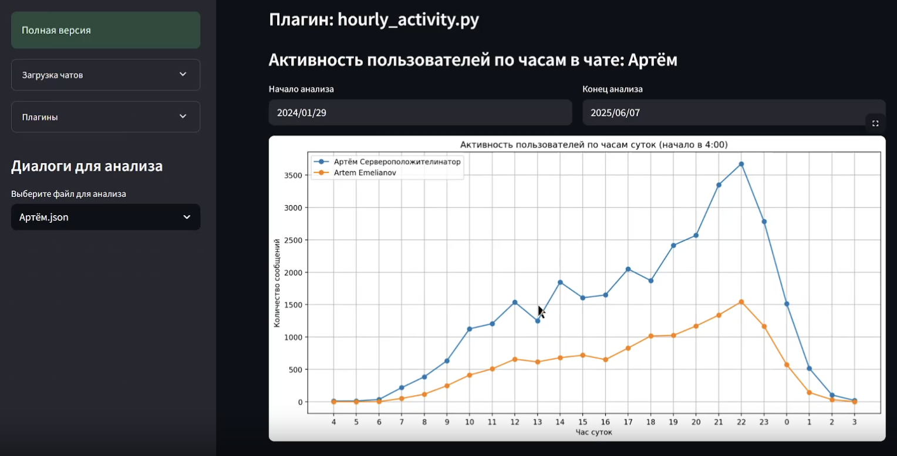

# TG Chats Analyzer

A Streamlit-based analyzer for Telegram chat exports with an extensible plugin system for visualizing messaging patterns, activity, and interactions.

<div align="center">

</div>

## Features

- **Multi-chat Support**: Load and switch between multiple chat exports
- **Plugin Hot Reload**: Upload custom analysis plugins on the fly
- **Built-in Plugins**: Comes with 5 ready-to-use analysis plugins

## Setup

### Prerequisites

- Python
- Telegram chat export in JSON format

### Installation

1. Clone this repository:

```bash
git clone https://github.com/mordvn/tgchatsanalyzer.git
cd tgchatsanalyzer
```

2. Install dependencies:

```bash
uv sync
```

### Exporting Telegram Chats

1. Open Telegram Desktop (not from appstore!)
2. Go to the chat you want to analyze
3. Click on the three dots menu ~> "Export chat history"
4. Select JSON format
5. Choose what to include (messages are required)
6. Export and save the JSON file

## Usage

Start the application:

```bash
uv run streamlit run src/main.py
```

### How to Use

1. Upload your Telegram chat JSON file using the sidebar
2. Select the chat to analyze from the dropdown
3. View analysis results from built-in plugins
4. Optionally upload custom plugins for additional analysis

### Built-in Plugins

- **messages_counter.py**: Shows message count per user
- **hourly_activity.py**: Plots activity by hour with date range selection
- **radio_silence.py**: Lists periods of 30+ hours without messages
- **reactions_per_user.py**: Analyzes emoji reactions usage
- **reply_network.py**: Creates a network graph of replies between users

### Creating Custom Plugins

Create a Python file with a `run_plugin(data)` function:

```python
import streamlit as st

def run_plugin(data):
    messages = data.get("messages", [])
    chat_name = data.get("name", "Chat")

    st.subheader(f"My Analysis — {chat_name}")
    # Your analysis code here
    st.write(f"Total messages: {len(messages)}")
```

Upload your plugin through the sidebar to use it.

## License

[GPL-3.0](https://choosealicense.com/licenses/gpl-3.0/)

Original work © Ty0111a. Modified by mordvn.
